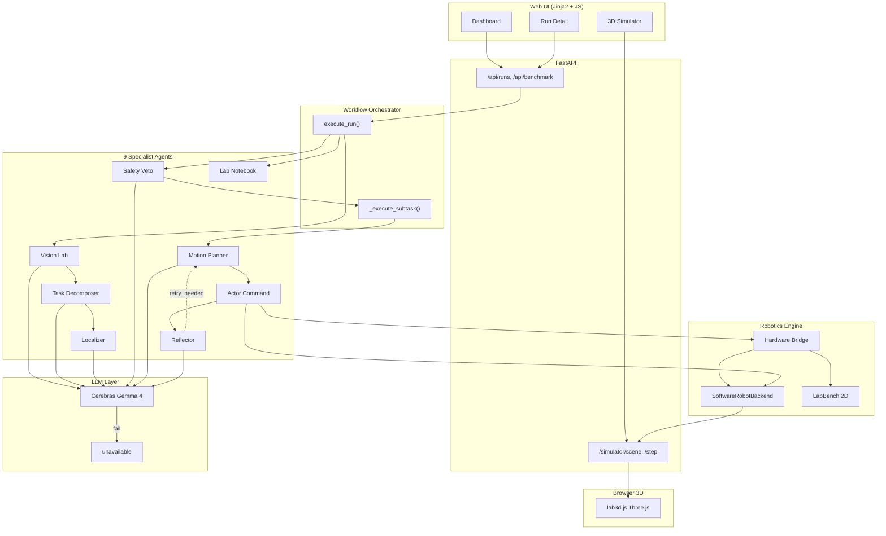
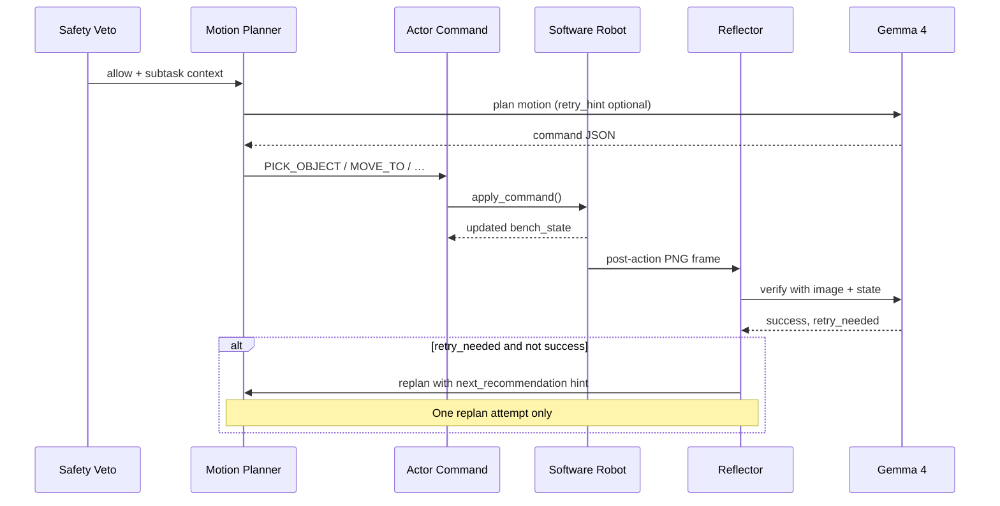
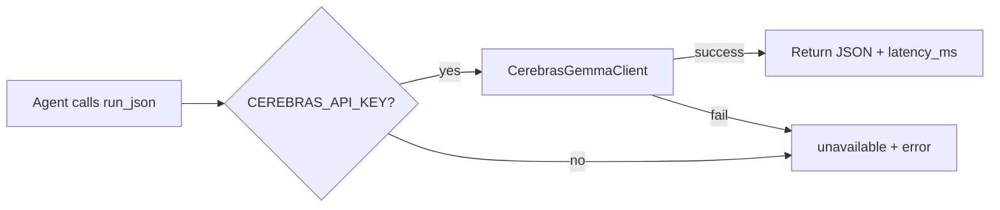

# VialPilot Swarm — System Design

---

## 1. Overview

VialPilot Swarm is a closed-loop autonomous lab-bench controller. A human operator provides a **natural-language instruction** and **multimodal scene evidence** (image, MP4 video, or live simulator camera). Nine specialist agents collaborate to analyze the scene, decompose the task, enforce safety, plan robot motion, execute in a 3D simulator, **visually verify** each action, and **replan** when verification fails.

The system is built to showcase how **Gemma 4 31B on Cerebras** enables real-time multimodal agent loops for physical AI — not static Q&A, but observe → reason → act → verify → replan.

### Design goals

| Goal | How we achieve it |
|------|-------------------|
| Multi-agent collaboration | 9 agents with explicit handoffs and persisted audit trail |
| Multimodal intelligence | Image + video frames + post-action simulator vision in one Gemma 4 call |
| Speed in action | Per-agent `latency_ms`, workflow `speed_summary`, live benchmark API |
| Physical AI | Commands drive a WebGL robot arm; state syncs between Python backend and browser |
| Reliability | SQLite persistence for replay; clear errors when API key missing |

---

## 2. High-level architecture



---

## 3. Agent collaboration model

### Agent roster

| # | Agent | File | LLM? | Responsibility |
|---|-------|------|------|----------------|
| — | Orchestrator | `workflow.py` | No | Runs pipeline, sets status, emits events |
| 1 | Vision Lab | `agents/vision_lab_agent.py` | Yes | Multimodal scene analysis — objects, zones, hazards, bboxes |
| 2 | Task Decomposer | `agents/task_decomposer_agent.py` | Yes | Instruction + vision → ordered subtasks |
| 3 | Localizer | `agents/localizer_agent.py` | Yes | Vision objects → simulator coordinates |
| 4 | Safety Veto | `agents/safety_veto_agent.py` | Yes | Per-subtask risk gate (`allow` / `block`) |
| 5 | Motion Planner | `agents/motion_planner_agent.py` | Yes | Subtask → robot command (`PICK_OBJECT`, `MOVE_TO`, …) |
| 6 | Actor Command | `agents/actor_command_agent.py` | No | Dispatches commands to simulator / MQTT / webhook |
| 7 | Reflector | `agents/reflector_agent.py` | Yes | Post-action visual verification; triggers replan |
| 8 | Lab Notebook | `agents/lab_notebook_agent.py` | No | Audit summary — verified actions, blocks, replans |

All LLM agents call `run_json()` in `llm/client.py`, which returns structured JSON plus `latency_ms` and `mode` (`real` | `unavailable`).

### Subtask execution loop

Each subtask runs **plan → act → reflect**, with an optional **one-shot replan**:



**Replan guards:**
- At most **one** replan per subtask (`allow_replan=True` default)
- On replan pass, Reflector sets `retry_needed=False` to prevent infinite loops
- Events `replan_started` / `replan_completed` are written to the run timeline

---

## 4. Multimodal vision pipeline

### Input sources

| Source | Path | Frames sent to LLM |
|--------|------|-------------------|
| Uploaded image | `POST /api/runs/{id}/upload` → `upload_paths` | 1 |
| Uploaded MP4 | `files.extract_video_frames()` → `frame_paths` | Up to `MAX_VISION_FRAMES` (default 4) |
| Simulator camera | `get_vision_input()` → `observation_for_vision()` | 1 (if no upload) |
| Post-action verify | `_verification_frame()` → `get_frame_png()` | 1 to Reflector |

### Frame flow

```
MP4 upload
  └─ OpenCV VideoCapture
       └─ sample MAX_VIDEO_FRAMES (8) evenly
            └─ save to data/uploads/{run_id}/frame_*.png
                 └─ workflow._pick_vision_frames()
                      └─ cap at MAX_VISION_FRAMES (4)
                           └─ llm/images.normalize_frames()
                                └─ CerebrasGemmaClient (base64 image_url parts)
```

### Vision Lab prompt strategy

When multiple frames are present, Vision Lab adds:

> *"You are given N sequential video frames — fuse evidence across time."*

Output schema: `objects[]`, `zones[]`, `hazards[]`, `uncertainties[]`, `visual_summary`, `frame_count`.

---

## 5. LLM — Cerebras Gemma 4 only

**File:** `src/vialpilot/llm/client.py`



| Provider | Module | Model | Multimodal |
|----------|--------|-------|------------|
| Cerebras Gemma 4 | `llm/cerebras_gemma.py` | `gemma-4-31b` (auto-discovered) | Base64 `image_url` in chat |

Model resolution: `CEREBRAS_MODEL=auto` → `cerebras_models.resolve_gemma4_model()` queries the public catalog.

No Gemini or offline mock — `CEREBRAS_API_KEY` is required for live operation.

---

## 6. Robotics & 3D simulator

### Backend state machine

**`SoftwareRobotBackend`** (`simulator/software_robot.py`) is a deterministic state machine (no PyBullet required on Windows):

- Commands: `PICK_OBJECT`, `PLACE_OBJECT`, `MOVE_TO`, `OPEN_GRIPPER`, `CLOSE_GRIPPER`
- State: scene objects, arm joints, gripper, held object
- Vision: `robot_renderer.render_frame()` → PNG in `ROBOT_OBS_DIR`

**`SimulatorSession`** (`simulator/session.py`) wraps the backend as a singleton per scene.

### Frontend WebGL

**`lab3d.js`** (Three.js):
- Inverse kinematics for 4-DOF arm
- Joint-space interpolation for visible sweep motion
- Arc pick/place paths (`animateSweepPick`, `animateSweepPlace`)
- Polls `GET /simulator/scene` to sync with backend state

**`simulator.js`** (SimLab UI):
- Initializes scene via `POST /simulator/init`
- Sweep demo and manual step controls
- Pipeline HUD: idle → approach → grip → sweep → place → home

### Command routing

```
ActorCommandAgent
  └─ hardware/bridge.py → HardwareBridge.dispatch()
       ├─ simulator_mode auto/robot → SoftwareRobotBackend.apply_command()
       ├─ lab_bench → LabBench.apply_command() (2D fast path)
       ├─ mqtt → paho-mqtt publish
       └─ webhook → HTTP POST
```

---

## 7. Data model

**SQLite** via SQLAlchemy (`db/models.py`):

### `runs` table

| Field | Purpose |
|-------|---------|
| `instruction`, `scene_id` | User task |
| `status` | `created` → `uploaded` → `running` → `completed` / `blocked` / `failed` |
| `upload_paths`, `frame_paths` | Vision inputs |
| `visual_observations` | Vision Lab output |
| `agent_outputs` | Full agent timeline (JSON) |
| `commands` | Robot command log |
| `safety_decisions` | Safety Veto audit |
| `latency_metrics` | `speed_summary`, `wall_clock_ms`, `replan_count` |
| `bench_state` | Final simulator snapshot |
| `final_report` | Lab Notebook report |
| `current_agent` | Live stepper indicator |

### `run_events` table

Timeline events: `workflow_started`, `agent_started`, `agent_completed`, `replan_started`, `replan_completed`, `human_confirmed`.

---

## 8. Speed & observability

### Per-call latency

Every `run_json()` call records `latency_ms`. Each agent output stores `mode` (`real` | `unavailable`).

### Workflow metrics (`_metrics()`)

```json
{
  "agent_calls": 12,
  "real_llm_calls": 8,
  "avg_llm_latency_ms": 847.5,
  "wall_clock_ms": 4200,
  "replan_count": 1,
  "speed_summary": "12 agents · 4.2s wall · 8 Gemma 4 calls avg 848ms on Cerebras",
  "cerebras_advantage": true
}
```

### Speed benchmark API

`POST /api/benchmark/speed?iterations=3`

Runs N repeated Vision Lab calls against a simulator frame and returns `avg_ms`, `min_ms`, `max_ms`, `headline`. Used by Dashboard and Settings UI buttons.

---

## 9. API surface

### Core workflow

| Method | Endpoint | Description |
|--------|----------|-------------|
| POST | `/api/runs` | Create run |
| POST | `/api/runs/{id}/upload` | Upload image and/or MP4 |
| POST | `/api/runs/{id}/execute` | Start agent pipeline |
| POST | `/api/runs/{id}/confirm` | Human-in-the-loop override |
| GET | `/api/runs/{id}/events` | Live event stream |
| GET | `/api/runs/{id}/report` | JSON or Markdown report |

### Individual agents (debug / extension)

| Method | Endpoint |
|--------|----------|
| POST | `/api/agent/vision` |
| POST | `/api/agent/decompose` |
| POST | `/api/agent/safety` |
| POST | `/api/agent/plan` |
| POST | `/api/agent/reflect` |

### Simulator

| Method | Endpoint |
|--------|----------|
| GET | `/simulator/scene` |
| GET | `/simulator/frame.png` |
| POST | `/simulator/init` |
| POST | `/simulator/step` |

---

## 10. Configuration

See `.env.example`. Critical variables:

| Variable | Default | Notes |
|----------|---------|-------|
| `CEREBRAS_API_KEY` | — | Required for live inference |
| `CEREBRAS_MODEL` | `auto` | Resolves to `gemma-4-31b` |
| `MAX_VIDEO_FRAMES` | `8` | Extracted from MP4 |
| `MAX_VISION_FRAMES` | `4` | Sent per LLM vision call |
| `SIMULATOR_MODE` | `auto` | `lab_bench` for fastest tests |
| `HARDWARE_MODE` | `simulation` | `mqtt` / `webhook` for real hardware |

---

## 11. Deployment

```bash
pip install -r requirements.txt
cp .env.example .env   # add CEREBRAS_API_KEY
python app.py          # http://127.0.0.1:7860
```

Docker: `docker build -t vialpilot .` — single `requirements.txt`, production mode, analyzer disabled.

Tests: `pytest` — 24 tests covering workflow, upload, benchmark, safety, HTML routes.

