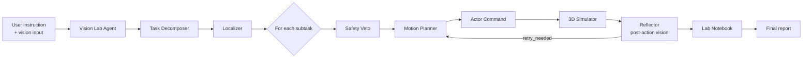

# VialPilot Swarm

**Autonomous robotics lab** powered by Gemma 4 on Cerebras — multimodal vision, nine collaborating agents, 3D robot execution, visual verification, and one-shot replan.

[](#agent-pipeline)
[](#llm-stack)
[](#testing)

---

## What is VialPilot?

VialPilot is a **closed-loop embodied agent** for laboratory automation. You give it:

1. A **natural-language instruction** (*"Move the red vial to the safe tray, avoid the contaminated zone"*)
2. **Multimodal scene evidence** — a bench photo, an MP4 video, or a live simulator camera frame

The system then runs a full **observe → reason → act → verify → replan** cycle:

```
Vision analysis  →  Task decomposition  →  Object localization
       →  Safety check  →  Motion plan  →  Robot execution
              →  Visual verification  →  [Replan if needed]  →  Audit report
```

This is physical AI — not a chatbot. Commands move a robot arm in a browser-based 3D lab, and every action is visually verified before the pipeline continues.

> Full system design: **[DESIGN.md](DESIGN.md)** — architecture diagrams, agent contracts, data model, API reference.

---

## Core capabilities

| Capability | Details |
|------------|---------|
| **Multi-agent pipeline** | 9 specialist agents with Reflector-triggered **one-shot replan** and full event timeline |
| **Multimodal vision** | Text + image + **MP4 video** (up to 4 frames/call) + **post-action simulator vision** |
| **Speed metrics** | Per-agent `latency_ms`, **Speed in Action** panel, live **⚡ Speed Benchmark** API |
| **3D robotics lab** | WebGL robot arm, hazard zones, human-in-the-loop, MQTT/webhook hardware bridge |

---

## Quick start

### Prerequisites

- Python 3.9+
- `CEREBRAS_API_KEY` for live demo ([get one here](https://inference.cerebras.ai/))

### Install & run

```powershell
# Windows
git clone https://github.com/SahilRakhaiya05/VialPilot.git
cd VialPilot
python -m venv .venv
.venv\Scripts\activate
pip install -r requirements.txt
copy .env.example .env
# Edit .env → add CEREBRAS_API_KEY=your_key
python app.py
```

```bash
# macOS / Linux
python3 -m venv .venv && source .venv/bin/activate
pip install -r requirements.txt
cp .env.example .env
python app.py
```

Open **http://127.0.0.1:7860/dashboard** and start a workflow.

---

## 60-second demo script

| Step | Action |
|------|--------|
| 1 | Dashboard → select **Hazard Avoidance** scene |
| 2 | Upload a **PNG/JPG** or **MP4 video** (or click **📷 Simulator Capture**) |
| 3 | Instruction: *"Move the red sample vial to the safe tray and avoid the contaminated zone."* |
| 4 | Click **▶ Start Workflow** → watch agent stepper + **Speed in Action** panel |
| 5 | Open **Simulator** tab → arm sweep pick/place animation |
| 6 | Click **⚡ Speed Benchmark** → show live Gemma 4 latency on Cerebras |

---

## How it works

### End-to-end flow



### 1. Vision intake

When you upload files or capture from the simulator:

| Input | Processing | LLM frames |
|-------|------------|------------|
| PNG / JPG / WEBP | Stored in `upload_paths` | 1 frame |
| MP4 video | OpenCV extracts up to 8 frames → caps at 4 for Gemma 4 | 1–4 frames |
| Simulator camera | `observation_for_vision()` renders PNG from robot backend | 1 frame |

Vision Lab returns structured JSON: detected objects with bounding boxes, hazard zones, contamination areas, and uncertainties.

### 2. Task decomposition

Task Decomposer converts your instruction + vision output into ordered subtasks:

```json
{
  "id": "subtask_1",
  "goal": "Pick red vial from bench",
  "target_object": "red_vial",
  "destination": "safe_tray"
}
```

### 3. Localization & safety

- **Localizer** maps vision objects to simulator coordinates (`x`, `y`, zone).
- **Safety Veto** evaluates each subtask against hazards. Blocked moves require **human confirmation** via the run page banner.

### 4. Plan → Act → Verify → Replan

For every subtask, the pipeline executes:

1. **Motion Planner** — Gemma 4 generates a robot command (`PICK_OBJECT`, `PLACE_OBJECT`, `MOVE_TO`)
2. **Actor Command** — dispatches to `SoftwareRobotBackend` (no LLM; pure execution)
3. **Reflector** — receives a **fresh simulator PNG** after the move and asks Gemma 4: *did it work?*

If Reflector returns `retry_needed: true`:

```
replan_started event → Motion Planner (with hint) → Actor → Reflector again → replan_completed
```

Maximum **one replan per subtask** to prevent infinite loops.

### 5. 3D simulator sync

```
Python backend (SoftwareRobotBackend)
    ↕  GET /simulator/scene  (JSON state)
    ↕  POST /simulator/step  (apply command)
Browser (lab3d.js + Three.js)
    → IK solver, joint interpolation, arc sweep animations
```

The arm visibly sweeps during pick/place — joint-space interpolation ensures smooth motion, not teleportation.

### 6. Audit & report

**Lab Notebook** compiles: verified actions, safety blocks, replan count, total latency, final bench state. Available as JSON or Markdown via `/api/runs/{id}/report`.

---

## Agent pipeline

| Agent | LLM | Role |
|-------|-----|------|
| **Orchestrator** | — | Workflow execution, status, events |
| **Vision Lab** | Gemma 4 | Multimodal scene analysis (multi-frame video) |
| **Task Decomposer** | Gemma 4 | Natural language → subtasks |
| **Localizer** | Gemma 4 | Object → simulator coordinates |
| **Safety Veto** | Gemma 4 | Hazard gate per subtask |
| **Motion Planner** | Gemma 4 | Subtask → robot command |
| **Actor Command** | — | Execute in simulator / MQTT / webhook |
| **Reflector** | Gemma 4 | Post-action visual verification + replan trigger |
| **Lab Notebook** | — | Audit trail and final summary |

Source files: `src/vialpilot/agents/`

---

## LLM stack

```
Agent call
  → Cerebras Gemma 4 31B  (primary, multimodal, JSON mode)
      → Gemini 2.5 Flash   (fallback)
          → Mock offline    (tests, no API key)
```

- **Provider detection:** `GET /api/health` and nav badge (`Live` / `Offline`)
- **Model auto-discovery:** `CEREBRAS_MODEL=auto` resolves `gemma-4-31b` from the Cerebras catalog
- **Every call tracked:** `latency_ms` + `mode` stored per agent output

---

## Speed in action

### Workflow metrics (every run)

Displayed on the run detail page **Speed in Action** panel:

| Metric | Description |
|--------|-------------|
| `wall_clock_ms` | Total workflow wall time |
| `avg_llm_latency_ms` | Average across live Gemma 4 calls |
| `real_llm_calls` | Count of non-mock inference calls |
| `replan_count` | Number of replan cycles triggered |
| `speed_summary` | Human-readable one-liner |

### Live benchmark

```bash
curl -X POST "http://127.0.0.1:7860/api/benchmark/speed?iterations=3"
```

Runs 3× Vision Lab calls against a simulator frame. UI buttons on **Dashboard** and **Settings**.

---

## API reference

### Workflow

| Method | Endpoint | Description |
|--------|----------|-------------|
| `GET` | `/api/health` | Server, provider, model status |
| `GET` | `/api/settings` | Active LLM configuration |
| `POST` | `/api/runs` | Create a new lab run |
| `POST` | `/api/runs/{id}/upload` | Upload image and/or MP4 |
| `POST` | `/api/runs/{id}/execute` | Start the agent pipeline |
| `POST` | `/api/runs/{id}/confirm` | Human-in-the-loop safety override |
| `GET` | `/api/runs/{id}/events` | Live event timeline |
| `GET` | `/api/runs/{id}/report` | Final report (`?format=markdown`) |
| `POST` | `/api/benchmark/speed` | Gemma 4 vision latency benchmark |

### Simulator

| Method | Endpoint | Description |
|--------|----------|-------------|
| `GET` | `/simulator/scene` | Current robot + bench state (JSON) |
| `GET` | `/simulator/frame.png` | Rendered camera frame |
| `POST` | `/simulator/init` | Reset scene |
| `POST` | `/simulator/step` | Apply a robot command |

### Web pages

| URL | Page |
|-----|------|
| `/` | Landing |
| `/dashboard` | Start workflows |
| `/simulator` | 3D Robot Lab |
| `/runs` | History |
| `/runs/{id}` | Live run detail + speed panel |
| `/settings` | AI config + benchmark |

---

## Configuration

Copy `.env.example` → `.env`:

| Variable | Default | Description |
|----------|---------|-------------|
| `CEREBRAS_API_KEY` | — | **Required for live demo** |
| `CEREBRAS_MODEL` | `auto` | `auto` discovers Gemma 4 31B |
| `GEMINI_API_KEY` | — | Fallback provider |
| `PORT` | `7860` | Web server port |
| `MAX_VIDEO_FRAMES` | `8` | Frames extracted from MP4 |
| `MAX_VISION_FRAMES` | `4` | Frames per Gemma 4 vision call |
| `SIMULATOR_MODE` | `auto` | `auto` / `robot` / `lab_bench` |
| `HARDWARE_MODE` | `simulation` | `simulation` / `mqtt` / `webhook` |
| `ENABLE_PIPELINE_ANALYZER` | `true` | Dash GUI on port 8050 |

---

## Project structure

```
app.py                          # Entry point
requirements.txt                # Single install file
DESIGN.md                       # Architecture & system design
src/vialpilot/
  api/                          # FastAPI routes + Jinja2 UI
  agents/                       # 9 specialist agents
  llm/                          # Cerebras Gemma 4 + Gemini + images
  services/                     # Workflow, benchmark, reports, uploads
  simulator/                    # SoftwareRobotBackend + LabBench
  static/                       # lab3d.js, simulator.js, app.js, CSS
  templates/                    # Dashboard, simulator, run detail
  db/                           # SQLAlchemy models + repository
  hardware/                     # MQTT / webhook bridge
tests/                          # 24 pytest tests
```

---

## Testing

```bash
pytest
```

| Suite | Covers |
|-------|--------|
| `test_workflow.py` | Full mock agent pipeline |
| `test_benchmark.py` | Speed benchmark API |
| `test_workflow_metrics.py` | Speed summary metrics |
| `test_upload.py` | Image upload path |
| `test_safety.py` | Safety veto blocking |
| `test_runs.py` | API + HTML routes |

---

## Docker

```bash
docker build -t vialpilot .
docker run -p 7860:7860 --env-file .env vialpilot
```

---

## Troubleshooting

| Problem | Solution |
|---------|----------|
| Nav shows **Offline** | Add `CEREBRAS_API_KEY` to `.env`, restart server |
| Port 7860 in use | Kill old `python app.py` or set `PORT=7861` |
| Stale UI | Hard refresh: **Ctrl+Shift+R** (cache v=29) |
| Benchmark 404 | Restart server after `git pull` |
| Video upload fails | `pip install opencv-python-headless` |
| Arm not sweeping | Open `/simulator`, click Sweep Demo |

---

## Tech stack

| Layer | Technology |
|-------|------------|
| Backend | Python 3.9+, FastAPI, SQLAlchemy, SQLite |
| LLM | Cerebras API (Gemma 4 31B), Google Gemini fallback |
| Vision | Pillow, OpenCV (video frame extraction) |
| Frontend | Jinja2, vanilla JS, Chart.js |
| 3D Lab | Three.js WebGL (`lab3d.js`) |
| Hardware | paho-mqtt, webhook bridge (optional) |

---

## Links

**Repository:** [github.com/SahilRakhaiya05/VialPilot](https://github.com/SahilRakhaiya05/VialPilot)

**Documentation site:** [vialpilot-swarm.vercel.app](https://vialpilot-swarm.vercel.app) (deploy from `website/`)

---

## Documentation website (Vercel)

A static docs site lives in `website/` — ready for Vercel:

```bash
npm i -g vercel
vercel
```

Or connect the GitHub repo in the [Vercel dashboard](https://vercel.com) — `vercel.json` points to `website/`.

| Page | URL |
|------|-----|
| Home | `/` |
| Getting Started | `/getting-started` |
| Architecture | `/architecture` |
| API Reference | `/api` |

Set `DOCS_SITE_URL` in `.env` to your Vercel URL so the app nav links to your deployed docs.